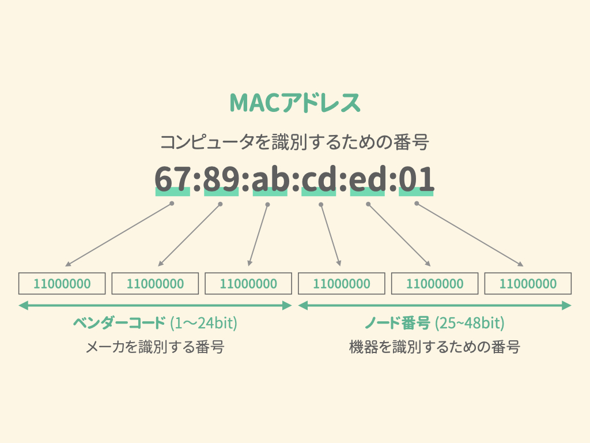

# データリンク層 / 物理層

© 2020 Kubota Hideya All Rights Reserved. 

## データリンク層の役割
機器同士を繋ぐ方法にはいくつかの方法があり、**同一の方法で繋げたひとかたまりをデータリンク** といいます。インターネットは多くのデータリンクの集まりで構成されており、データリンク層はそのデータリンク同士の持つ違いを吸収する役割を持っています。

## イーサネット
イーサネットは **データリンク層と物理層で使用されているプロトコル** です。 
イーサネットではネットワーク層から受け取ったパケットに以下の情報を付加することによって **フレーム** を作成します。

- **プリアンブル**: 受信側にフレームを **受け取る準備** をさせ、フレームが **始まること** を示す値。
- **イーサネットヘッダー**: 宛先と送信元の **MACアドレス**(後述) などが記載される。
- **FCS**: フレームが破損していないかをチャックするための値。

データリンク層では、こうやって生成された **フレームをビット列(0と1で構成された数列)に変換** したり、物理層から **受け取ったビット列をフレームとして認識** したりします。

## 物理層
データリンクの中で信号が流れている部分を物理層といいます。ここでは、**ビット列を 電気信号, 光信号 などの信号に変換、復元** が行われます。その方法はコンピュータ自体が持つ性質に依存しているため、決まったプロトコルは持ちません。

また、コンピュータとネットワークを繋ぐ玄関口となるのが **ネットワークカード(NIC)** という機器です。LANカードやネットワークアダプタとも呼ばれます。

## MACアドレス
イーサネットは「MACアドレス」という48bitのビット列で構成された識別子を使用して、**コンピュータを識別**しています。MACアドレスは「a8:66:7f:00:80」や「00-50-56-c0-00-01」のように8bitハイフンやコロンで区切って、16進数で表現されます。

MACアドレスは、各コンピュータの **ネットワークカード** に割り振られており、データリンク層では、この固有の番号を使って **機器を特定** します。

また、MACアドレスの上位24bitと下位24bitにはそれぞれ異なる意味があります。
上位24bitは **ベンダーコード(OUI)** と呼ばれており、**機器を作成したメーカーを識別** できる番号です。
上位24bitは **ノード番号** と呼ばれており、**機器を一意に特定する** ためにメーカーが独自に割り振った番号です。

##  ARPプロトコル
データリンク内ではMACアドレスを使って宛先の機器を特定するので「宛先のIPアドレスはわかるけど、MACアドレスがわからない」という場合は宛先にデータを届けることができません。 
**ARPプロトコル** はそのような時に **IPアドレスから相手のMACアドレスを調べるプロトコル** です。

この具体的な手順は以下の通りです。

1. MACアドレスを知りたいコンピュータのIPアドレスを **ブロードキャストMACアドレス**(後述) 宛てに送信する。
2. 受信側は送信されたIPアドレスが自分のものと一致した場合、 **MACアドレスを送り返す**。

### ブロードキャストMACアドレス
同じデータリンク内に存在する全てのコンピュータに同時にデータを送ることができるMACアドレスを **ブロードキャストMACアドレス** といいます。ブロードキャストMACアドレスは、 **全てのビットに1が入っている** ので **「ff:ff:ff:ff:ff:ff」** と表されます。

## MACアドレスとIPアドレス
MACアドレストIPアドレスって役割が似ているように感じますが、大きな違いが2つ存在します。それは「 **アドレスの付け方** 」と「 **使用用途** 」です。

### アドレスの付け方
MACアドレスはコンピュータごとに割り振られる物理的なアドレスです。これは製品の出荷時に割り振られるもので **あとで変更することはできません** 。

一方でIPアドレスはコンピュータがネットワークに接続する際に **DHCPサーバー** によって割り振られるものです。こちらはMACアドレスと違って、**割り振り後も変更可能**　です。

### 使用用途
ネットワークの中をデータが移動する際、送信元から宛先のコンピューターへ直接データが届けられる訳ではありません。実際には途中でいくつかの ルーター を経由して宛先のコンピュータへ届きます。

その上で

- MACアドレスは **「次にどの機器に伝送されるか？」**
- IPアドレスは **「宛先はどのアドレスか？」**

という情報が記載されます。 
「宛先はどのアドレスか？」というIPアドレスは **送信元で決定** され、「次にどの機器に伝送されるか？」というMACアドレスは **ルーターを経由するごとに更新** されていきます。

## まとめ
- データリンクとは、**機器が同一の方法で繋げたひとかたまり** を指す。
- イーサネットではパケットに以下の情報を付加することによって **フレーム** を作成する。
  - **プリアンブル**: 受信側にフレームを **受け取る準備** をさせ、フレームが **始まること** を示す値。
  - **イーサネットヘッダー**: 宛先と送信元の **MACアドレス**(後述) などが記載される。
  - **FCS**: フレームが破損していないかをチャックするための値。
- データリンク層では **生成したフレームをビット列に変換** する。
- 物理層では **ビット列を信号に変換** する。
- ネットワークカードは **コンピュータとネットワークを繋ぐ玄関口** の役割を果たす機器。
- MACアドレスは **コンピュータを識別するための番号** 。
- ARPプロトコルは **IPアドレスから相手のMACアドレスを調べるプロトコル** 。
- MACアドレスは **「次にどの機器に伝送されるか？」** を示すために使用される。
- IPアドレスは **「宛先はどのアドレスか？」** を示すために使用される。