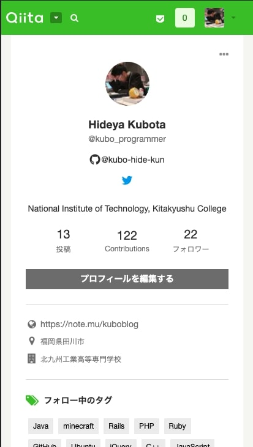
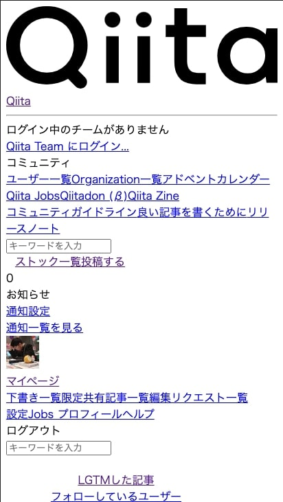

# 基本知識 (Web編)

## Webサイトとは
「Webサイト」とは，ある組織や個人がインターネット上に公開する，**ひとまとまりのWebページ** のことを単に指します。Webサイトは単に「サイト」「ホームページ」と呼ばれることがあり，ほとんどの同じような意味で使われます。

## Webページとは
「Webページ」とは，**Webブラウザ(※1)で一度に表示される画面**のことを指します。単にページと呼ばれることもあります。このWebページにはテキストや画像，動画などの **コンテンツ** が掲載されます。

:::tip
具体的な役割に関しては後述の章で解説しますが，Webブラウザは **Webページを閲覧する為のアプリケーション** です。現在主要なブラウザは以下の **~~5つ~~ 4つ**です。
- **Google Chrome（グーグルクローム）**
- **Firefox（ファイヤーフォックス）**
- **Microsoft Edge（マイクロソフト エッジ）**
- **~~Internet Explorer（インターネットエクスプローラー）~~**
- **Safari（サファリ）**
:::

## Webサイトを構成するファイル
1枚のWebページは，**HTMLファイル**を中心として，レイアウトを調整する**CSSファイル**，動きを加える**JavaScriptファイル**など複数のファイルで構成されています。ブラウザはそれらの関連ファイルをWebサーバからダウンロードしてきて，1つのWebページにまとめて表示します。

### 骨組みを作る「HTML」
Webページを作るために最低限用意しなければならないのがHTMLファイルです。基本的に1枚のHTMLファイルが，1枚のWebページになります。
ページに掲載するテキストや画像の情報に**タグ付け(役割を記載)して**，**構造化する**ことが主な役割です。HTMLの拡張子は「.html」です。

``` html
<h1>タイトル</h1>
<h3>見出し</h3>
<p>テキストテキスト</p>
<input />
<button>クリック!</button>
```

<center style="margin:8px 0;">↓ 表示結果</center>
<div style="border:2px groove #888;border-radius: 24px;padding: 16px 24px;margin-bottom:48px;">
  <h1 style="margin:4px !important;padding:4px !important;">タイトル</h1>
  <h3 style="margin:8px 4px !important;padding:4px !important;">見出し</h3>
  <p style="margin:4px !important;padding:4px">テキストテキスト</p>
  <input style="margin:6px;padding:4px;"/>
  <button style="cursor: pointer;">クリック!</button>
</div>

#### よく使われるタグ
タグ | 説明 | 具体例
:--: | :--: | :--:
`<h1>` | 見出し | <h1 style="margin:4px !important;padding:4px !important;">見出し1</h1>
`<p>` | 段落 | <p style="margin:4px !important;padding:4px">段落段落段落段落段落段落段落段落段落</p>
`<input>` | 入力フォーム | <input placeholder="ここに文字を入力" style="padding:4px;"></input>
`<button>` | ボタン | <button style="cursor: pointer">クリックできますよ</button>
`<a>`  | 任意のサイトへのリンク | <a href="#">指定したサイトに飛べます</a>


### レイアウトを調整する「CSS」
HTMLには掲載するテキストや画像などの「コンテンツ」を構造化して，書き表す機能はありますが，ページをWebブラウザに表示するときの「テキストの色」「背景色」「レイアウト」などを調整する機能はありません。
読みやすく，見た目もかっこいいWebページを作るにはHTMLをレイアウトする為の**スタイルシート**が必要です。そして，このスタイルシートを作成する為の言語が**CSS**です。

下の2枚の画像は[Qiita](https://qiita.com/kubo_programmer)と呼ばれるプログラミングに関するWebサイトの写真です。
1枚目は普通のアクセスした場合の状態，2枚目はこのサイトからCSSを削除した写真です。

CSSアリ | CSSナシ
:--: | :--:
 | 

### 動きを加える「JavaScript」
Webページは**静的ページ**と**動的ページ**というように分けることができます。

#### 静的ページ
> **何度アクセスしても同じものが表示されるWebページ**

企業や団体の紹介サイトなどはいつも同じ情報を表示する必要があるため，一般的に静的ページで構成されます。

#### 動的ページ
> **アクセスした時の状況に応じて異なる内容が表示されるWebページ**

動的ページの例としては，
「ユーザーが書き込むたびに**内容が変わっていく**掲示板サイト」
「ログインする**ユーザーごとに異なる情報を表示する**会員サイト」
などがあります。

<br>

HTMLとCSSだけではこういった動的なWebページを作成することは不可能です。
そこで必要なのが **JavaScript** というコンピュータ言語です。この言語は**Webブラウザ上で動作可能**という性質があり，それによりWebサイトの開発で重宝されています。

## まとめ

- Webサイトとは **「ひとまとまりのWebページ」**
- Webページとは **Webブラウザで一度に表示される画面**
- Webページは **骨組みを作る「HTML」**, **レイアウトを調整する「CSS」**, **動きを加える「JavaScript」** などのファイルによって構成される。